<div align="center">


<br />

<a href="mailto:gnotterodev@gmail.com"></a>


</div>

<br />

### `whoami`

I'm **Valerio** (aka **Gnottero**), a 22-year-old Computer Engineering student at PoliTo 🇮🇹.

I suffer from a rare condition known as *having way too many interests*. My repos have absolutely nothing to do with each other: a card game website, a workout tracker, a self-hosted cloud, Minecraft mods, a dish-washing rota for my flat… If it sounds fun, I've already run `mkdir` on it.

```diff
+ side projects started     ∞
- side projects finished    loading…
! current interest          whatever I saw 5 minutes ago
```

<br />

### `ls ~/now`

<p align="center">
  <a href="https://github.com/Gnottero/Bless"></a>
  <a href="https://github.com/Gnottero/Eina"></a>
</p>
<p align="center">
  <a href="https://github.com/Gnottero/Theonis"></a>
</p>

<br />

### `ls ~/side-quests`

<table>
  <tr><th align="left">Project</th><th align="left">What it is</th><th align="left">Status</th></tr>
  <tr><td><a href="https://github.com/Gnottero/vscode-scarpet"><b>vscode-scarpet</b></a></td><td>VS Code extension for Scarpet that pulls its API straight from your own Carpet build</td><td>🟢 shipped</td></tr>
  <tr><td><a href="https://github.com/Gnottero/Racven"><b>Racven</b></a></td><td>Web app that decides whose turn it is to do the dishes, plus live-shared aphorisms. Short for <i>“Ricordati Anima Candida: Vasche Enormi Necessitano”</i></td><td>🧽 keeping the peace</td></tr>
  <tr><td><a href="https://github.com/Gnottero/Asclepius"><b>Asclepius</b></a></td><td>Server-side Minecraft mod for the AsclepiusSMP</td><td>🟢 alive</td></tr>
  <tr><td><a href="https://github.com/Gnottero/Appunti"><b>Appunti</b></a></td><td>My PoliTo course notes, written in Typst</td><td>📖 exam fuel</td></tr>
  <tr><td><a href="https://github.com/Gnottero/IntesaCollegiante"><b>IntesaCollegiante</b></a></td><td>Play the Italian game <i>Intesa Vincente</i> with a custom wordlist</td><td>🎉 party-tested</td></tr>
  <tr><td><a href="https://github.com/Gnottero/Cassiopeia"><b>Cassiopeia</b></a></td><td>Minecraft mod for modular structures</td><td>💤 napping</td></tr>
  <tr><td><a href="https://github.com/Gnottero/MedievalBeasts"><b>MedievalBeasts</b></a></td><td>Minecraft mod full of medieval-ish beasts</td><td>🦴 fossil</td></tr>
  <tr><td><a href="https://github.com/Gnottero/Proton"><b>Proton</b></a> · <a href="https://github.com/Gnottero/Nucleus"><b>Nucleus</b></a></td><td>Datapack library and datapack generator: where it all began</td><td>🏛️ 2020, ancient history</td></tr>
</table>

<br />

### `cat ~/.toolbox`

<p align="center">
  <picture>
    <source media="(prefers-color-scheme: light)" srcset="https://skillicons.dev/icons?i=python,ts,js,java,kotlin,svelte,nextjs,fastapi,docker,postgres,git,arch,vscode&theme=light&perline=13" />
    
  </picture>
</p>

<br />

### `git log --stat`



<br />

<p align="center">
  <sub>Have a weird project idea? I'm probably already interested. Too interested.<br />
  This README was accurate when I wrote it. By now I've probably started three new projects.</sub>
</p>
